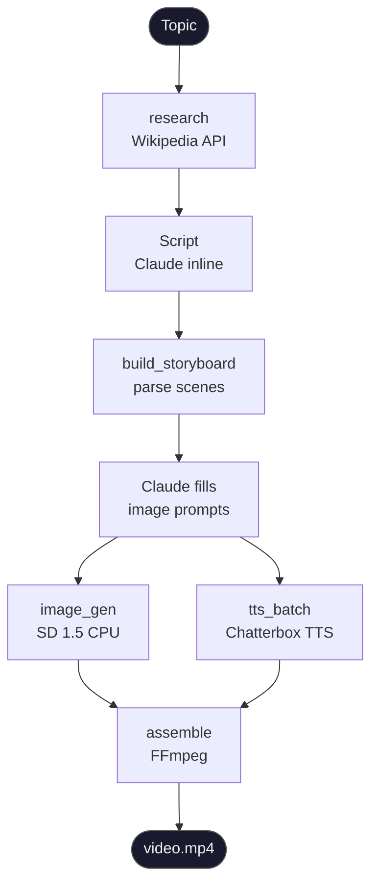

# mcp-server-documentary-generation

> **Status: MVP / Proof of Concept**
> End-to-end pipeline is working. See [Next Steps](#next-steps) for planned upgrades from local inference to production APIs.

An autonomous documentary generation system orchestrated by **Claude Code via MCP (Model Context Protocol)**. Given a topic, it produces a narrated video with AI-generated visuals — with minimal human intervention.

Built as a portfolio project demonstrating agentic AI orchestration, local ML inference, and multi-modal content pipelines.

---

## What It Does

1. Fetches and summarises Wikipedia research on a topic (Greek-first, English fallback)
2. Parses a structured script into timestamped scenes
3. Generates image prompts per scene (Byzantine manuscript style)
4. Renders images locally with Stable Diffusion 1.5
5. Synthesises Greek narration with Chatterbox Multilingual TTS
6. Assembles everything into a video with Ken Burns effect via FFmpeg

**Test output:** a ~2-minute Greek-language documentary on the Fall of Constantinople (1453).

---

## Architecture



### MCP Tool Layer

Claude Code acts as the orchestrator. Each stage is exposed as an MCP tool that Claude can call autonomously:

| Tool | Description |
|---|---|
| `research` | Fetch Wikipedia outline, save to `research/<topic>/outline.txt` |
| `build_storyboard` | Parse script into scenes, initialise project folder |
| `save_storyboard` | Persist scenes with image prompts filled by Claude |
| `tts_batch` | Synthesise narration WAV per scene (checkpointed) |
| `image_gen` | Generate image PNG per scene (checkpointed) |
| `assemble` | Combine audio + image → MP4 with Ken Burns effect |

---

## Stack

| Component | Technology | Notes |
|---|---|---|
| Orchestration | Claude Code (MCP) | No extra API calls — Claude itself fills prompts |
| Research | Wikipedia API | Greek Wikipedia first, English fallback |
| Image generation | SD 1.5 (`runwayml/stable-diffusion-v1-5`) | Local CPU, ~4 min/image |
| TTS | Chatterbox Multilingual (ResembleAI) | Greek (`el`), MIT licence, local CPU |
| Audio stretch | librosa `time_stretch` | Slows narration to 0.85× for documentary pacing |
| Video assembly | FFmpeg | Ken Burns (`zoompan`), AAC audio, H.264 |
| Visual style | Byzantine manuscript prompts | Pencil sketch, aged parchment, charcoal, 16:9 |

---

## Project Structure

```
mcp-server-documentary-generation/
├── server.py                  # MCP server — registers all tools
├── tools/
│   ├── project.py             # Folder layout helpers (slugify, scene_paths)
│   ├── research.py            # Wikipedia fetch → outline.txt
│   ├── storyboard.py          # Script parser → scenes.json
│   ├── tts_batch.py           # Chatterbox batch TTS
│   ├── image_gen.py           # SD 1.5 batch image generation
│   └── assemble.py            # FFmpeg video assembly
├── script/
│   └── aloси_1453.txt         # Test script (Greek, 5 scenes)
├── storyboard/
│   └── scenes.json            # Committed scene index with prompts
└── generated/                 # Gitignored — all media output lives here
    └── <title>/
        ├── scenes.json
        ├── video.mp4
        └── scene_XX/
            ├── script.txt
            ├── image.png
            └── audio.wav
```

---

## Output Example

**Topic:** Η Άλωση της Κωνσταντινούπολης (1453)
**Language:** Greek
**Scenes:** 5 (HOOK → ΠΕΡΙΒΑΛΛΟΝ → ΠΤΩΣΗ → ΤΕΛΟΣ → ΕΠΙΛΟΓΟΣ)
**Runtime:** ~2 minutes
**Style:** Byzantine manuscript illustration, pencil sketch on aged parchment

---

## Running It

### Prerequisites

```bash
pip install -r requirements.txt
winget install ffmpeg  # Windows
```

### Run a stage manually

```bash
# Research
py -m tools.research "Άλωση της Κωνσταντινούπολης"

# Parse script into scenes
py -m tools.storyboard script/aloси_1453.txt --title "Άλωση 1453"

# Generate TTS for all scenes
py -m tools.tts_batch generated/Άλωση_1453/scenes.json --title "Άλωση 1453"

# Generate images (20 diffusion steps)
py -m tools.image_gen generated/Άλωση_1453/scenes.json --title "Άλωση 1453" --steps 20

# Assemble final video
py -m tools.assemble generated/Άλωση_1453/scenes.json --title "Άλωση 1453"
```

### Run via MCP (Claude Code)

Add to your Claude Code MCP config:
```json
{
  "mcpServers": {
    "documentary": {
      "command": "py",
      "args": ["-m", "server"],
      "cwd": "/path/to/mcp-server-documentary-generation"
    }
  }
}
```

Then Claude Code can call `research`, `build_storyboard`, `tts_batch`, `image_gen`, and `assemble` as tools directly.

---

## Checkpointing

Every tool skips files that already exist. You can interrupt and resume at any stage without re-running completed work:

- `tts_batch` → skips scenes with existing `audio.wav`
- `image_gen` → skips scenes with existing `image.png`
- `assemble` → skips scenes missing either asset

---

## Next Steps

This MVP validates the end-to-end pipeline. Production upgrades planned:

### Quality
- [ ] **Images:** Swap SD 1.5 CPU → **FLUX Dev** via Replicate API (10× better quality, seconds not minutes)
- [ ] **TTS:** Swap Chatterbox CPU → **ElevenLabs** or **Azure Neural TTS** (more natural, faster)
- [ ] **Research:** Add **ChromaDB RAG** for multi-source grounding beyond Wikipedia

### Features
- [ ] **Subtitles:** WhisperX forced alignment → `.srt` burn-in
- [ ] **Music:** Overlay public domain tracks (Musopen)
- [ ] **Upload:** YouTube Data API v3 — auto title, description, chapters, thumbnail
- [ ] **Thumbnail:** Auto-generate from scene 1 image + title overlay

### Scale
- [ ] Parameterise topic, language, and style via Claude conversation
- [ ] Support 15–25 min documentaries (currently ~2 min test)
- [ ] Fine-tune image prompts per historical period (Byzantine, Ottoman, Classical Greek)
